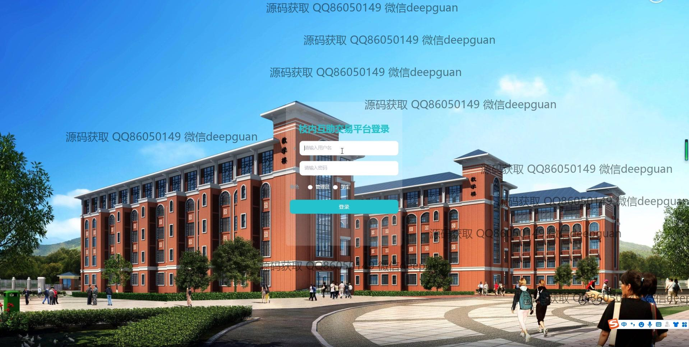
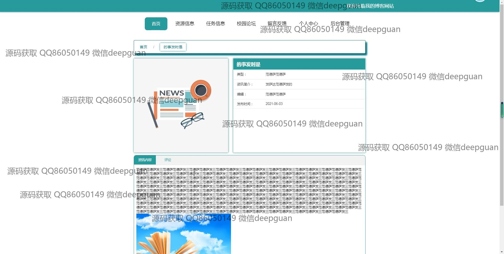
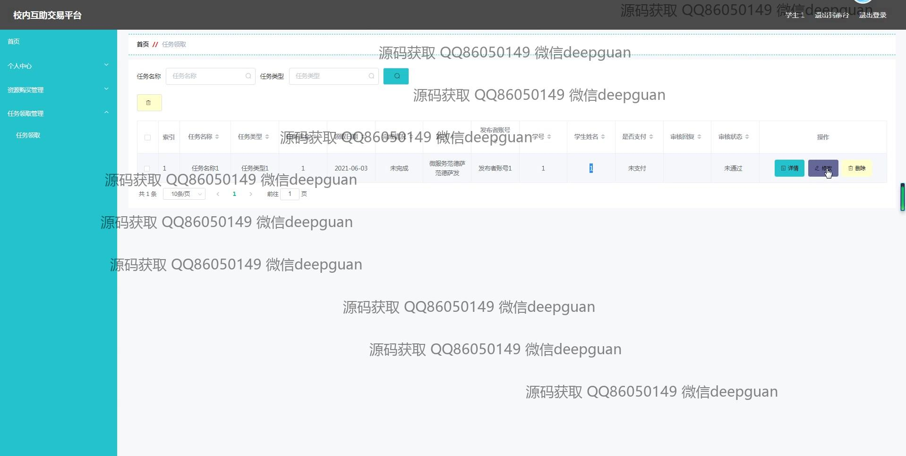
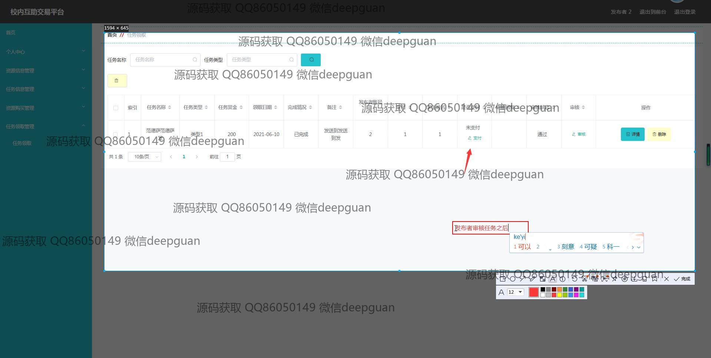

<h1 align="center">校内互助交易平台+vue</h1>

## 简介
校内互助交易平台：角色分为管理员、用户；功能包括用户注册与登录、资源信息管理、任务管理、校园论坛、个人中心等模块，便捷高效的资源和任务交易平台。    --计算机毕业设计源码；毕设源码；java毕业设计源码

## 联系方式

<h3 align="center">获取完整代码与数据库文件 + 微信：deepguan QQ: 86050149 QQ群: 783742310</h3>

<h3 align="center">可帮忙远程部署 包运行成功！提供远程部署、修改代码、设计文档指导、代码讲解等服务！</h3>

## 功能介绍（完整见运行截图）
管理员：提供登录、注册、退出功能；支持学生和资源信息的管理，包括添加、编辑、审核、删除等操作；导航栏包含个人中心、资源管理、任务管理和留言管理等模块；提供资讯发布与审核功能，以及用户信息的查看和权限管理；支持任务状态和资源状态的动态审核和更新。

用户：支持登录、注册和退出操作；提供个人中心模块，可修改个人信息、查看发布记录和管理收藏；支持资源信息的浏览、收藏、发布和交易；提供任务信息的发布、领取和完成记录；支持校园论坛与留言互动，便于信息交流和资源共享；提供资讯查看与评论功能。

发布者：支持发布与管理资源或任务信息；可填写资源名称、规格、数量、类型、价格等详细信息，并上传图片和描述；支持任务需求描述、积分设定与信息编辑；可以查看发布的资源或任务的评论、收藏与热议情况；提供管理模块用于发布内容的更新与删除。

学生：支持任务领取和资源购买操作；可通过导航栏浏览任务或资源信息，筛选和收藏感兴趣内容；提供详细的任务领取管理功能，包括完成状态记录与备注；支持通过论坛和留言模块互动，分享学习资源与校内资讯。

## 运行截图

本代码来源于网络,仅供学习参考使用!

